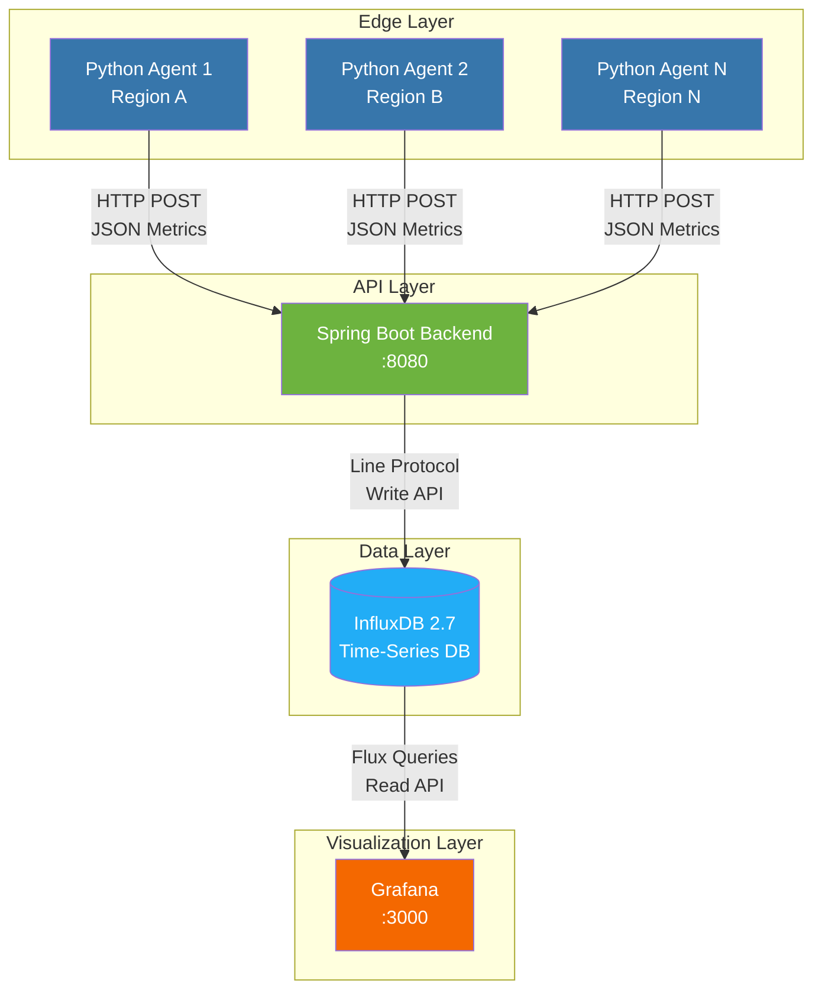

<div align="center">

# 🌐 EchoState

### Distributed Network Health Monitoring Platform

*Real-time observability for modern distributed systems*

[](https://openjdk.org/)
[](https://spring.io/projects/spring-boot)
[](https://www.python.org/)
[](https://www.docker.com/)

[](https://www.influxdata.com/)
[](https://grafana.com/)
[](LICENSE)
[](https://github.com/yourusername/echostate)

[Features](#-features) •
[Quick Start](#-quick-start) •
[Architecture](#%EF%B8%8F-architecture) •
[Documentation](#-documentation) •
[Roadmap](#%EF%B8%8F-roadmap)

</div>

---

## 🎯 Overview

**EchoState** is a production-grade, agent-based network observability platform designed for monitoring service availability and network latency across distributed systems. Built with modern DevOps practices, it combines the reliability of Java Spring Boot with the flexibility of Python agents, all orchestrated through Docker.

### Why EchoState?

- **🚀 Push-Based Architecture** - Agents work seamlessly behind NAT/Firewalls
- **📊 Real-Time Visualization** - Grafana dashboards with sub-second updates
- **⚡ Time-Series Optimized** - InfluxDB for high-performance metric storage
- **🐳 Container-Native** - Full Docker Compose orchestration
- **🔧 Production Ready** - Battle-tested stack with enterprise-grade components
- **📈 Scalable Design** - Multi-region deployment capable

---

## ✨ Features

<table>
<tr>
<td width="50%">

### 🔍 Monitoring Capabilities
- **Network Latency Tracking**
  - Sub-millisecond precision
  - Historical trend analysis
  - Geographic distribution support
  
- **Service Health Checks**
  - HTTP/HTTPS endpoint monitoring
  - Custom target configuration
  - Automatic failure detection

</td>
<td width="50%">

### 📊 Visualization & Alerts
- **Grafana Dashboards**
  - Real-time latency graphs
  - Status indicators
  - Custom threshold alerts
  
- **Data Persistence**
  - InfluxDB time-series storage
  - Flux query language support
  - Long-term metric retention

</td>
</tr>
</table>

---

## 🏗️ Architecture



### Technology Stack

| Component | Technology | Purpose |
|-----------|-----------|---------|
| **Agent** | Python 3.10 + Requests | Lightweight metric collection |
| **Backend** | Spring Boot 3.5 + Java 17 | REST API & data validation |
| **Database** | InfluxDB 2.7 | Time-series metric storage |
| **Visualization** | Grafana | Real-time dashboards |
| **Orchestration** | Docker Compose | Container management |

---

## 🚀 Quick Start

### Prerequisites

Ensure you have the following installed:

```bash
docker --version          # Docker 20.10+
docker compose version    # Docker Compose 2.0+
java -version            # Java 17+ (for local development)
```

### One-Command Deployment

```bash
# Clone the repository
git clone https://github.com/yourusername/echostate.git
cd echostate

# Build backend
cd backend && ./mvnw clean package -DskipTests && cd ..

# Start all services
docker compose up --build -d
```

### Verify Deployment

```bash
# Check all containers are running
docker compose ps

# View agent logs
docker compose logs agent --tail=20

# View backend logs
docker compose logs backend --tail=20
```

**Expected Output:**
```
agent-1     | ✅ Sucesso! O Java respondeu: Dados guardados no InfluxDB!
backend-1   | ✅ Gravado no InfluxDB com sucesso!
```

### Access Services

| Service | URL | Credentials |
|---------|-----|-------------|
| **Grafana Dashboard** | http://localhost:3000 | `admin` / `admin` |
| **InfluxDB UI** | http://localhost:8086 | `admin` / `admin12345678` |
| **Backend API** | http://localhost:8080 | No auth required |

---

## 📊 Grafana Setup

### Configure InfluxDB Data Source

1. Navigate to **⚙️ Configuration → Data Sources**
2. Click **Add data source → InfluxDB**
3. Configure settings:

```yaml
Query Language: Flux
URL: http://influxdb:8086
Organization: echostate
Token: my-super-secret-auth-token
Default Bucket: metrics_bucket
```

4. Click **Save & Test** ✅

### Create Your First Dashboard

**Query Example:**
```flux
from(bucket: "metrics_bucket")
  |> range(start: -15m)
  |> filter(fn: (r) => r["_measurement"] == "network_latency")
  |> filter(fn: (r) => r["_field"] == "latency_ms")
```

**Visualization:** Time Series  
**Unit:** Milliseconds (ms)  
**Thresholds:**
- 🟢 0-100ms (Good)
- 🟡 100-300ms (Acceptable)
- 🟠 300-500ms (Slow)
- 🔴 500ms+ (Critical)

---

## 📦 API Reference

### POST `/api/metrics`

Submit network metrics to the backend.

**Request Body:**
```json
{
  "host_name": "agent-container-01",
  "ip_address": "172.18.0.5",
  "target_service": "google.com",
  "latency_ms": 325,
  "status": "UP",
  "timestamp": "2026-02-01T16:42:22"
}
```

**Response:**
```json
HTTP/1.1 200 OK
Content-Type: text/plain

"Dados guardados no InfluxDB!"
```

**Status Codes:**
- `200 OK` - Metric successfully stored
- `400 Bad Request` - Invalid JSON or missing fields
- `500 Internal Server Error` - Database connection issue

---

## 📖 Documentation

For detailed setup instructions, troubleshooting, and advanced configuration:

📘 **[Complete Setup Guide](SETUP_GUIDE.md)** - Comprehensive documentation including:
- Detailed architecture breakdown
- Step-by-step installation
- Grafana dashboard configuration
- Metrics interpretation guide
- Common troubleshooting scenarios
- Best practices and optimization tips

---

## 🗺️ Roadmap

### Completed ✅

- [x] **Phase 1:** Core Agent-Backend Communication
  - REST API implementation
  - JSON metric serialization
  - Basic health checks

- [x] **Phase 2:** Containerization
  - Docker multi-service architecture
  - Docker Compose orchestration
  - Network isolation and service discovery

- [x] **Phase 3:** Data Persistence
  - InfluxDB integration
  - Time-series data modeling
  - Line Protocol optimization

- [x] **Phase 4:** Visualization Layer
  - Grafana dashboard setup
  - Flux query templates
  - Real-time monitoring panels

### In Progress 🚧

- [ ] **Phase 5:** Multi-Region Deployment
  - Agent clustering
  - Geographic distribution
  - Cross-region latency analysis

### Planned 📋

- [ ] **Phase 6:** Advanced Alerting
  - Threshold-based alerts
  - Notification channels (Email, Slack, PagerDuty)
  - Alert history and acknowledgment

- [ ] **Phase 7:** Security Hardening
  - JWT authentication for agents
  - API rate limiting
  - TLS/SSL encryption
  - Role-based access control (RBAC)

- [ ] **Phase 8:** Cloud Native Features
  - Kubernetes deployment manifests
  - Horizontal pod autoscaling
  - Service mesh integration
  - Prometheus metrics export

---

## 🛠️ Development

### Project Structure

```
echostate/
├── agent/                  # Python monitoring agent
│   ├── main.py            # Agent entry point
│   ├── requirements.txt   # Python dependencies
│   └── Dockerfile         # Agent container config
│
├── backend/               # Spring Boot API
│   ├── src/
│   │   └── main/
│   │       ├── java/      # Java source code
│   │       └── resources/ # Configuration files
│   ├── pom.xml           # Maven dependencies
│   └── Dockerfile        # Backend container config
│
├── docker-compose.yml    # Multi-container orchestration
└── SETUP_GUIDE.md       # Detailed documentation
```

### Local Development

**Backend:**
```bash
cd backend
./mvnw spring-boot:run
# API available at http://localhost:8080
```

**Agent:**
```bash
cd agent
python -m venv venv
source venv/bin/activate  # Linux/Mac
.\venv\Scripts\activate   # Windows
pip install -r requirements.txt
python main.py
```

### Testing

```bash
# Backend tests
cd backend && ./mvnw test

# Manual API test
curl -X POST http://localhost:8080/api/metrics \
  -H "Content-Type: application/json" \
  -d '{
    "host_name": "test-agent",
    "target_service": "google.com",
    "latency_ms": 42,
    "status": "UP"
  }'
```

---

## 🐳 Docker Commands

```bash
# Start all services
docker compose up -d

# View logs
docker compose logs -f

# Restart specific service
docker compose restart backend

# Stop all services
docker compose down

# Clean rebuild
docker compose down -v && docker compose up --build -d
```

---

## 🤝 Contributing

Contributions are welcome! This project was created for educational purposes and serves as a learning platform for:

- Distributed systems architecture
- Container orchestration
- Time-series databases
- Network monitoring concepts
- DevOps best practices

### How to Contribute

1. Fork the repository
2. Create a feature branch (`git checkout -b feature/amazing-feature`)
3. Commit your changes (`git commit -m 'Add amazing feature'`)
4. Push to the branch (`git push origin feature/amazing-feature`)
5. Open a Pull Request

---

## 📄 License

This project is licensed under the MIT License - see the [LICENSE](LICENSE) file for details.

---

## 👨‍💻 Author

**João Daniel Evaristo**

- 🎓 Network & Computer Engineering Student at [ISEL](https://www.isel.pt/)
- 💼 Focus: Backend Development, DevOps, Network Engineering
- 🌐 Passionate about distributed systems and observability

---

## 🙏 Acknowledgments

- **Spring Boot Team** - For the excellent framework and documentation
- **InfluxData** - For InfluxDB and the Java client library
- **Grafana Labs** - For the powerful visualization platform
- **Docker** - For containerization technology
- **ISEL** - For the educational foundation

---

<div align="center">

### ⭐ Star this repository if you find it useful!

**Built with ❤️ for learning and sharing knowledge**

[Report Bug](https://github.com/yourusername/echostate/issues) •
[Request Feature](https://github.com/yourusername/echostate/issues) •
[Documentation](SETUP_GUIDE.md)

</div>
