# 📡 EchoState - Distributed Network Health Monitor

> A lightweight, agent-based observability platform designed to monitor network latency and service availability in real-time.

## 📖 Overview

**EchoState** is a distributed monitoring system that bridges the gap between **Network Engineering** and **DevOps**. It uses lightweight Python agents deployed at the edge (on different subnets or regions) to collect network metrics (latency, availability) and pushes them to a central Spring Boot backend.

### 🏗️ Architecture (Push Model)

The system follows a **Push-based architecture**, allowing agents to operate behind NATs/Firewalls without requiring inbound open ports.

```mermaid
graph LR
    A[📡 Python Agent] -- HTTP POST (JSON) --> B[☕ Spring Boot API]
    A2[📡 Python Agent 2] -- HTTP POST --> B
    subgraph Backend
    B --> C((Log/Processing))
    end

```

Tech Stack

    Backend: Java 17, Spring Boot (Web, Lombok, DevTools).

    Agent: Python 3, requests library, schedule.

    Data Format: JSON (REST API).

    Future Integration: Docker, InfluxDB, Grafana.

🚀 Getting Started

Follow these instructions to run the Phase 1 MVP (Local Environment).
Prerequisites

    Java 17+

    Python 3.10+

    Maven (Wrapper included)

1. Start the Backend (Server)

The backend accepts metric data on port 8080.
Bash

cd backend
# Using Maven Wrapper (Windows)
.\mvnw spring-boot:run
# Using Maven Wrapper (Linux/Mac)
./mvnw spring-boot:run

Expected Output: Tomcat started on port 8080
2. Start the Agent (Client)

The agent simulates network checks (Ping/HTTP) and sends data to the backend.
Bash

cd agent
# Create virtual environment (recommended)
python -m venv venv
.\venv\Scripts\activate  # Windows
source venv/bin/activate # Linux/Mac

# Install dependencies
pip install requests schedule

# Run the agent
python main.py

Expected Output: ✅ Success! Server responded: Data received
📦 API Contract

The Agent sends data to POST /api/metrics using the following JSON structure:
JSON

{
  "hostName": "work-laptop-01",
  "ipAddress": "192.168.1.50",
  "targetService": "google.com",
  "latencyMs": 14,
  "status": "UP",
  "timestamp": "2026-01-28T10:00:00"
}

## 📖 Documentação Completa

Para um guia detalhado de setup e utilização, consulte o **[SETUP_GUIDE.md](SETUP_GUIDE.md)**

O guia inclui:
- 🏗️ Arquitetura completa com diagramas
- 🚀 Passo-a-passo de instalação
- 📊 Configuração do Grafana em detalhe
- 📈 Interpretação dos gráficos e métricas
- 🔧 Troubleshooting comum
- 🎓 Conceitos aprendidos

## 🗺️ Roadmap

- [x] **Phase 1:** MVP - Basic Agent-Server communication (HTTP/JSON)
- [x] **Phase 2:** Dockerization - Containerize Backend and Agent with Docker Compose
- [x] **Phase 3:** Persistence - Integrate InfluxDB to store time-series data
- [x] **Phase 4:** Visualization - Create Grafana Dashboards for real-time monitoring
- [ ] **Phase 5:** Multi-region deployment with multiple agents
- [ ] **Phase 6:** Alerting and incident management
- [ ] **Phase 7:** Authentication and API security

👤 Author

João Daniel Evaristo

    Student at ISEL (Network & Computer Engineering)

    Focus: Backend, DevOps, and Networks.

Project created for educational purposes.
